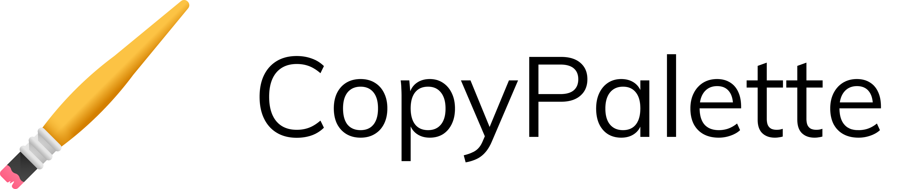

# CopyPalette

<p align='center'> 
<a href="https://woddd.run/" target="_blank"></a><br><br>
    Hassle-free color palettes export at SVG format for your favorite design tool (Figma, Sketch etc.)
</p>


---

## Usage example

CopyPalette was built for designers that struggle (or just feel bored) to generate a consistent monochromatic color palette. By fine-tuning some parameters, you can effortlessly create different shades and depths of a hue and export your palette in a single click!

_For more examples and usage, please refer to the [About page](https://copypalette.netlify.com/about)._

## Development setup

```sh
yarn
yarn start
```

## Release History

- 0.0.1
  - Functional MVP delpoyed at Netlify

## Meta

Dimitris Raptis – [@YourTwitter](https://twitter.com/d__raptis) – dimitrisraptis96@gmail.com

## License

Distributed under the [MIT license](./LICENSE).

## Contributing

1. Fork it (<https://github.com/dimitrisraptis96/copy-palette/fork>)
2. Create your feature branch (`git checkout -b feature/fooBar`)
3. Commit your changes (`git commit -am 'Add some fooBar'`)
4. Push to the branch (`git push origin feature/fooBar`)
5. Create a new Pull Request
